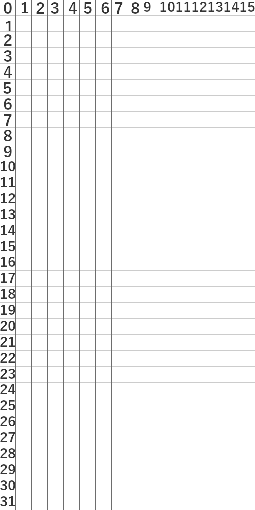
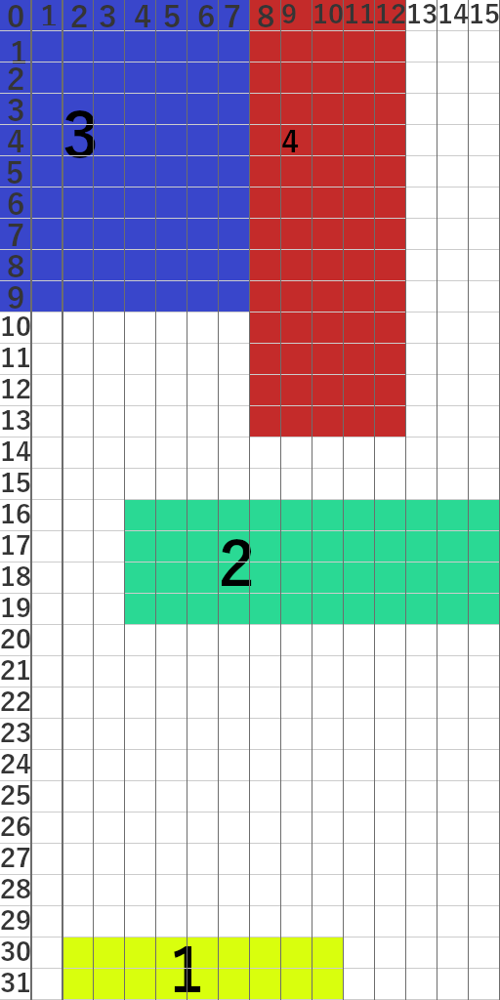

# Table layout in compose

Aim is to create a table layout in compose and explain how it was made steps by steps.

It is an example of custom layout creation in compose.

Menu:
* [What is a table layout ?](#what-is-a-table-layout-)
* [Create data classes](#create-data-classes)
* [Do the layout](#do-the-layout-)
  * [Scope creation](#scope-creation)
  * [How to use androidx.compose.ui.layout.Layout](#how-to-use-androidxcomposeuilayoutlayout)
  * [Measure the preferred component size](#measure-the-preferred-component-size)
  * [Resolve components final size and location](#resolve-components-final-size-and-location)
  * [Force compose use computed size](#force-compose-use-computed-size)
  * [Place the components](#place-the-components)
  * [The hidden issue and its correction](#the-hidden-issue-and-its-correction)
* [Usage example](#usage-example)

## What is a table layout ?

Table layout is place components inside a grid. Let imagine the parent component is cut in grid like this :


The we can place components inside like this :


* The component 1 (in yellow) it top left corner is at (2, 30) and takes 9 x 2 cells
* The component 2 (in green) it top left corner is at (4, 16) and takes 12 x 4 cells
* The component 3 (in blue) it top left corner is at (0, 0) and takes 8 x 10 cells
* The component 4 (in red) it top left corner is at (8, 0) and takes 5 x 14 cells

## Create data classes

We will need to store the each components table cell information, for this we can create the class

```kotlin
class TableCell(val cellX: Int, val cellY: Int, val width: Int = 1, val height: Int = 1)
```

We will want avoid width and height under 1, so we change to

```kotlin
import kotlin.math.max

class TableCell(val cellX: Int, val cellY: Int, width: Int = 1, height: Int = 1)
{
    val width = max(1, width)
    val height = max(1, height)
}
```

We will then after have to resolve the real location in parent and computed size. 
This information can be internal since it will be used and computed be the table layout and 
we don't want someone change them by accident.

The class becomes :
```kotlin
import kotlin.math.max

class TableCell(val cellX: Int, val cellY: Int, width: Int = 1, height: Int = 1)
{
    val width = max(1, width)
    val height = max(1, height)
    
    /** Computed x in the screen*/
    internal var x: Int = 0

    /** Computed y in the screen*/
    internal var y: Int = 0

    /** Computed width in the screen*/
    internal var realWidth: Int = 0

    /** Computed height in the screen*/
    internal var realHeight: Int = 0
}
```

## Do the layout

For create the layout, we well need a scope that store components constraints. 
We want have something that look likes other layout. 
That is something that looks like
```kotlin
TableLayout(modifier = modifer) {
  Text("", 
       modifier=Modifier.cell(cellX = 2, cellY = 2))

  Button(modifier=Modifier.cell(cellX = 5, cellY = 6, width = 12, height = 23)) { 
      Text("Click")
  }
}
```

For this, we will create a scope, is role will to make available the `cell` function and 
store the TableCell information. 

Here we face the first issue, composable are in function, not inside an object, 
we don't have a hand on components draw by the composable function. 
We will store the information in order they are declares, by chance the list wil will receive later
in this tutorial have the same order, so we can match by using the index.

* [Scope creation](#scope-creation)
* [How to use androidx.compose.ui.layout.Layout](#how-to-use-androidxcomposeuilayoutlayout)
* [Measure the preferred component size](#measure-the-preferred-component-size)
* [Resolve components final size and location](#resolve-components-final-size-and-location)
* [Force compose use computed size](#force-compose-use-computed-size)
* [Place the components](#place-the-components)
* [The hidden issue and its correction](#the-hidden-issue-and-its-correction)
* [Optimisation](#optimisation)

### Scope creation

Since `TableLayoutScope` will be called in **DSL** way, we can add some local extensions.
The first version of `TableLayoutScope` will be

```kotlin
import androidx.compose.ui.Modifier

class TableLayoutScope
{
    internal val cells = ArrayList<TableCell>()

    fun Modifier.cell(cellX: Int, cellY: Int, width: Int = 1, height: Int = 1)
    {
        this@TableLayoutScope.cells.add(TableCell(cellX, cellY, width, height))
    }
}
```

And the start of the `TableLayout` method is 

```kotlin
import androidx.compose.runtime.Composable
import androidx.compose.ui.Modifier

@Composable
fun TableLayout(modifier: Modifier = Modifier, content: @Composable TableLayoutScope.() -> Unit)
{
    val scope = TableLayoutScope()
    scope.content()

    // TODO layout composable here
}
```

It may look good, but as we will see in [How to use androidx.compose.ui.layout.Layout](#how-to-use-androidxcomposeuilayoutlayout)
we will need change the lines before the comment.

And in [The hidden issue and its correction](#the-hidden-issue-and-its-correction) their an hidden issue
in `TableLayoutScope`, that will force us to add a trick.

### How to use androidx.compose.ui.layout.Layout

For layout the components we will use `androidx.compose.ui.layout.Layout`.

So wil will write :

```kotlin
import androidx.compose.ui.Modifier

class TableLayoutScope
{
  internal val cells = ArrayList<TableCell>()

  fun Modifier.cell(cellX: Int, cellY: Int, width: Int = 1, height: Int = 1) : Modifier
  {
    this@TableLayoutScope.cells.add(TableCell(cellX, cellY, width, height))
    return this
  }
}
```

But we notice that `content` can't be used for two reasons :
* It is already called before, but we want it is called by layout with our scope
* Thew function gives to Layout must also be `@UiComposable` for `Layout` work properly

To solve this we change the code to

```kotlin
import androidx.compose.runtime.Composable
import androidx.compose.ui.Modifier
import androidx.compose.ui.UiComposable
import androidx.compose.ui.layout.Layout

@Composable
fun TableLayout(modifier: Modifier = Modifier, content: @Composable TableLayoutScope.() -> Unit)
{
    val scope = TableLayoutScope()

    val layoutContent = @Composable @UiComposable {
        scope.content()
    }

    Layout(modifier = modifier, content = layoutContent,
           measurePolicy = { measurables, constraints ->
               TODO()
           })
}
```

With this way, `content` used the scope and be called by layout since we give it a function to call.
More over, we use it to have a `@Composabale` that is also a `@UiComposable`

The lambda function gives to the `measurePolicy` parameter will do the layout.
It have two values : 
* `measurables` : List of components to measure (in their creation order). 
  They are the composable defines in the `TableLayoutScope`
* `constraints` : Are the parents constraints : that is to say the minimum and maximum size we can use

The measure policy requires to return a `MeasureResult`, that contains the measured components.

We will have it by call the `layout` method that will place components.
Note :
> `layout` method must be called only one time and in preference at last things do.

### Measure the preferred component size

To layout the component we will need a cell dimension.
For this we compute the minimum and maximum cell position.

```kotlin
          // Compute cell dimension
          val parentWidth = constraints.maxWidth
          val parentHeight = constraints.maxHeight
          var minCellX = Int.MAX_VALUE
          var maxCellX = Int.MIN_VALUE
          var minCellY = Int.MAX_VALUE
          var maxCellY = Int.MIN_VALUE
          
          // Measure components preferred size
          for (cell in scope.cells)
          {
            minCellX = min(minCellX, cell.cellX)
            maxCellX = max(maxCellX, cell.cellX + cell.width)
            minCellY = min(minCellY, cell.cellY)
            maxCellY = max(maxCellY, cell.cellY + cell.height)
          }
          
          val cellWidth = if (maxCellX > minCellX) parentWidth / (maxCellX - minCellX) else 1
          val cellHeight = if (maxCellX > minCellY) parentHeight / (maxCellY - minCellY) else 1
```

Note:
> For some case you may need to have the components preferred size, 
> to get them you can do :

```kotlin
               for ((index, measurable) in measurables.withIndex())
               {
                   val cell = scope.cells[index]
                   cell.preferredWidth = measurable.maxIntrinsicWidth(parentWidth)
                   cell.preferredHeight = measurable.maxIntrinsicHeight(parentHeight)
               }
```

> With this you can store temporary the measured preferred size.
> And if you want be clever you can use this loop to compute something else in same time like

```kotlin
               for ((index, measurable) in measurables.withIndex())
               {
                   val cell = scope.cells[index]
                   cell.preferredWidth = measurable.maxIntrinsicWidth(parentWidth)
                   cell.preferredHeight = measurable.maxIntrinsicHeight(parentHeight)
                   minCellX = min(minCellX, cell.cellX)
                   maxCellX = max(maxCellX, cell.cellX + cell.width)
                   minCellY = min(minCellY, cell.cellY)
                   maxCellY = max(maxCellY, cell.cellY + cell.height)
               }
```
> By example

### Resolve components final size and location

Now we can compute components location and dimension

```kotlin
          // Compute components position and dimension
          for (cell in scope.cells)
          {
            cell.x = (cell.cellX - minCellX) * cellWidth
            cell.y = (cell.cellY - minCellY) * cellHeight
            cell.realWidth = cellWidth * cell.width
            cell.realHeight = cellHeight * cell.height
          }
```

### Force compose use computed size

By default `Layout`will use the component preferred size. 
But we want it use our computed size.
To do so we will force it to measure components with our constraints.
The trick is to not give compose a choice on giving it as minimum and maximum the value we want.

```kotlin
               // Force compose use computed size
               for ((index, measurable) in measurables.withIndex())
               {
                   val cell = scope.cells[index]

                   val placeable = measurable.measure(
                       constraints.copy(
                           minWidth = cell.realWidth,
                           minHeight = cell.realHeight,
                           maxWidth = cell.realWidth,
                           maxHeight = cell.realHeight
                                       )
                                                     )
               }
```

Note : 
> we use a copy of the constraints with modification, 
> because it is the most simple way to have an instance with the value we want. 

For the last step we will need the computed `placeable` to place it.
So we add this field to `TableCell` and store it this loop.

```kotlin
import androidx.compose.ui.layout.Placeable
import kotlin.math.max

class TableCell(val cellX: Int, val cellY: Int, width: Int = 1, height: Int = 1)
{
    val width = max(1, width)
    val height = max(1, height)

    /** Computed x in the screen*/
    internal var x: Int = 0

    /** Computed y in the screen*/
    internal var y: Int = 0

    /** Computed width in the screen*/
    internal var realWidth: Int = 0

    /** Computed height in the screen*/
    internal var realHeight: Int = 0

    /** Placeable to used for place the component*/
    internal var placeable: Placeable? = null
}
```

And the loop become :

```kotlin
               // Force compose use computed size
               for ((index, measurable) in measurables.withIndex())
               {
                   val cell = scope.cells[index]

                   cell.placeable= measurable.measure(
                       constraints.copy(
                           minWidth = cell.realWidth,
                           minHeight = cell.realHeight,
                           maxWidth = cell.realWidth,
                           maxHeight = cell.realHeight
                                       )
                                                     )
               }
```

### Place the components

The last step is to place components on computed coordinated.
Like said in [How to use androidx.compose.ui.layout.Layout](#how-to-use-androidxcomposeuilayoutlayout)
we will use the `layout` method

```kotlin
         //Place components
         layout(parentWidth, parentHeight)
         {
            for (cell in scope.cells)
            {
              cell.placeable?.place(cell.x, cell.y)
            }
         }
```

We give in parameter the parent size, since we want it uses all the parent space.
But if your layout is smaller (bigger is not recommended) than the parent space, it is possible tho give something else.

To place the component just use the `place` method

### The hidden issue and its correction

If we try this

```kotlin
    var visible: Boolean by remember { mutableStateOf(false) }

    TableLayout(modifier = modifier) {
        Text(text = "Hello $name!",
             modifier = Modifier.background(Color.Red).cell(0, 0, 2, 1))

        Text(text = "Small text",
             modifier = Modifier.background(Color.Blue).cell(0, 1))

        Button(modifier = Modifier.background(Color.Green).cell(1, 1),
               onClick = { visible = visible.not() }) {
            Text(text = "Click me")
        }
    }
```

We get what we expect:


But if we change the code on

```kotlin
    var visible: Boolean by remember { mutableStateOf(true) }

    TableLayout(modifier = modifier) {
        Text(text = "Hello $name!",
             modifier = Modifier
                 .background(Color.Red)
                 .cell(0, 0, 2, 1))

        if (visible)
        {
            Text(text = "Small text",
                 modifier = Modifier
                     .background(Color.Blue)
                     .cell(0, 1))
        }

        Button(modifier = Modifier
            .background(Color.Green)
            .cell(1, 1),
               onClick = { visible = visible.not() }) {
            Text(text = "Click me")
        }
    }
```

When we click on the button instead of hide the **Small Text** it crash with the error
`java.lang.IllegalStateException: Place was called on a node which was placed already`

Other remarks is if we do 

```kotlin
    var visible: Boolean by remember { mutableStateOf(true) }

    TableLayout(modifier = modifier) {
        Text(text = "Hello $name!",
             modifier = Modifier
                 .background(Color.Red)
                 .cell(0, 0, 2, 1))

        
            Text(text = "Small text",
                 modifier = Modifier
                     .background(Color.Blue)
                     .cell(0,  1, 
                           1, if(visible) 1 else 2))

        Button(modifier = Modifier
            .background(Color.Green)
            .cell(1, 1),
               onClick = { visible = visible.not() }) {
            Text(text = "Click me")
        }
    }
```

Click on the button does nothing instead of change the layout.

To understand what happen, first keep the last version, and put some logs.

To be sure visible is changed, and able to track tests more easily we had log for `visible` state.

```kotlin
    var visible: Boolean by remember { mutableStateOf(true) }
    Log.d("REMOVE_ME", "---- visible = $visible ----")
```

Then in `TableLayoutScope` in method cell 

```kotlin
import android.util.Log
import androidx.compose.ui.Modifier

class TableLayoutScope
{
    internal val cells = ArrayList<TableCell>()

    fun Modifier.cell(cellX: Int, cellY: Int, width: Int = 1, height: Int = 1): Modifier
    {
        this@TableLayoutScope.cells.add(TableCell(cellX, cellY, width, height))
        Log.d("REMOVE_ME", "cells size =${this@TableLayoutScope.cells.size} because cell added : $cellX, $cellY, $width, $height ")
        return this
    }
}
```

Log we have after launch :

```text
REMOVE_ME               fr.jhelp.tablelayout                 D  ---- visible = true ----
REMOVE_ME               fr.jhelp.tablelayout                 D  cells size =1 because cell added : 0, 0, 2, 1 
REMOVE_ME               fr.jhelp.tablelayout                 D  cells size =2 because cell added : 0, 1, 1, 1 
REMOVE_ME               fr.jhelp.tablelayout                 D  cells size =3 because cell added : 1, 1, 1, 1 
```

That what we expected, now click on button :

```text
REMOVE_ME               fr.jhelp.tablelayout                 D  ---- visible = false ----
REMOVE_ME               fr.jhelp.tablelayout                 D  cells size =4 because cell added : 0, 0, 2, 1 
REMOVE_ME               fr.jhelp.tablelayout                 D  cells size =5 because cell added : 0, 1, 1, 2 
REMOVE_ME               fr.jhelp.tablelayout                 D  cells size =6 because cell added : 1, 1, 1, 1 
```

Cells constraints are correct, but we notice that cells array have grow, it was not start from zero.
But in `TableLayout` we do 

```kotlin
    val scope = TableLayoutScope()

    val layoutContent = @Composable @UiComposable {
        scope.content()
    }
```

So we could think that a new instance of `TableLayoutScope` is created each time. 
But in fact compose optimize the code at compilation, it changed. The code executed is not the one we typed.
That implies in the optimization phase, compose will store the instance of `TableLayoutScope` one time 
and reuse it.

With this information, we will change `TableLayoutScope` to force to start at zero the cell array at each compose.
For this we need to know when components are finished to be added.
For this we add a method in `TableLayoutScope` and call it in `TableLayout`method.

```kotlin
import android.util.Log
import androidx.compose.ui.Modifier

class TableLayoutScope
{
    internal val cells = ArrayList<TableCell>()

    fun Modifier.cell(cellX: Int, cellY: Int, width: Int = 1, height: Int = 1): Modifier
    {
        this@TableLayoutScope.cells.add(TableCell(cellX, cellY, width, height))
        Log.d("REMOVE_ME", "cells size =${this@TableLayoutScope.cells.size} because cell added : $cellX, $cellY, $width, $height ")
        return this
    }
    
    fun seal()
    {
    }
}
```

```kotlin
@Composable
fun TableLayout(modifier: Modifier = Modifier, content: @Composable TableLayoutScope.() -> Unit)
{
    val scope = TableLayoutScope()

    val layoutContent = @Composable @UiComposable {
        scope.content()
        scope.seal()
    }

    // ...
}
```

Now we have a method called when content is draw.

```kotlin
import android.util.Log
import androidx.compose.ui.Modifier

class TableLayoutScope
{
    private var index = 0
    private var maximumIndex = Int.MAX_VALUE
    internal val cells = ArrayList<TableCell>()

    fun Modifier.cell(cellX: Int, cellY: Int, width: Int = 1, height: Int = 1): Modifier
    {
        if(this@TableLayoutScope.index>=this@TableLayoutScope.maximumIndex)
        {
            this@TableLayoutScope.index = 0
        }
        
        val cell = TableCell(cellX, cellY, width, height)
        
        if( this@TableLayoutScope.index >= this@TableLayoutScope.cells.size)
        {
            this@TableLayoutScope.cells.add(cell)    
        }
        else
        {
            this@TableLayoutScope.cells[this@TableLayoutScope.index] = cell
        }
        
        this@TableLayoutScope.index ++
        Log.d("REMOVE_ME", "size=${this@TableLayoutScope.cells.size} index=${this@TableLayoutScope.index} / ${this@TableLayoutScope.maximumIndex}")
        return this
    }
    
    fun seal()
    {
        this.maximumIndex = this.index
    }
}
```

If we launch the test, now this list size is still 3 and we reuse elements. But visually nothing change.
To solve this we will use a list that compose will notice its change. 
And to avoid infinite loop composition, we update the cell only if there real change.

```kotlin
import android.util.Log
import androidx.compose.runtime.mutableStateListOf
import androidx.compose.ui.Modifier
import kotlin.math.max

class TableLayoutScope
{
    private var index = 0
    private var maximumIndex = Int.MAX_VALUE
    internal val cells = mutableStateListOf<TableCell>()

    fun Modifier.cell(cellX: Int, cellY: Int, width: Int = 1, height: Int = 1): Modifier
    {
        val localWidth = max(1, width)
        val localHeight = max(1, height)

        if (this@TableLayoutScope.index >= this@TableLayoutScope.maximumIndex)
        {
            this@TableLayoutScope.index = 0
        }

        if (this@TableLayoutScope.index >= this@TableLayoutScope.cells.size)
        {
            this@TableLayoutScope.cells.add(TableCell(cellX, cellY, localWidth, localHeight))
        }
        else
        {
            val cell = this@TableLayoutScope.cells[this@TableLayoutScope.index]

            if (cell.cellX != cellX || cell.cellY != cellY || cell.width != localWidth || cell.height != localHeight)
            {
                this@TableLayoutScope.cells[this@TableLayoutScope.index] = TableCell(cellX, cellY, localWidth, localHeight)
            }
        }

        this@TableLayoutScope.index++
        Log.d("REMOVE_ME", "size=${this@TableLayoutScope.cells.size} index=${this@TableLayoutScope.index} / ${this@TableLayoutScope.maximumIndex} : cell=$cellX, $cellY : $width x $height")
        return this
    }

    fun seal()
    {
        this.maximumIndex = this.index
        Log.d("REMOVE_ME", "seal : ${this.maximumIndex}")
    }
}
```

Now its work and logs becomes after button click :

```text
REMOVE_ME               fr.jhelp.tablelayout                 D  ---- visible = false ----
REMOVE_ME               fr.jhelp.tablelayout                 D  size=3 index=1 / 3 : cell=0, 0 : 2 x 1
REMOVE_ME               fr.jhelp.tablelayout                 D  size=3 index=2 / 3 : cell=0, 1 : 1 x 2
REMOVE_ME               fr.jhelp.tablelayout                 D  size=3 index=3 / 3 : cell=1, 1 : 1 x 1
REMOVE_ME               fr.jhelp.tablelayout                 D  cell=0, 0 : 1080 x 696
REMOVE_ME               fr.jhelp.tablelayout                 D  cell=0, 696 : 540 x 1392
REMOVE_ME               fr.jhelp.tablelayout                 D  cell=540, 696 : 540 x 696
REMOVE_ME               fr.jhelp.tablelayout                 D  size=3 index=1 / 3 : cell=0, 0 : 2 x 1
REMOVE_ME               fr.jhelp.tablelayout                 D  size=3 index=2 / 3 : cell=0, 1 : 1 x 2
REMOVE_ME               fr.jhelp.tablelayout                 D  size=3 index=3 / 3 : cell=1, 1 : 1 x 1
```

As we see it is recompose two times, first to recompute components and second to realize their no change

Now let test the previous crash version :

```kotlin
    var visible: Boolean by remember { mutableStateOf(true) }

    TableLayout(modifier = modifier) {
        Text(text = "Hello $name!",
             modifier = Modifier
                 .background(Color.Red)
                 .cell(0, 0, 2, 1))

        if (visible)
        {
            Text(text = "Small text",
                 modifier = Modifier
                     .background(Color.Blue)
                     .cell(0, 1))
        }

        Button(modifier = Modifier
            .background(Color.Green)
            .cell(1, 1),
               onClick = { visible = visible.not() }) {
            Text(text = "Click me")
        }
    }
```

It stills crashing. Let find a solution.

The error is `java.lang.IllegalStateException: Place was called on a node which was placed already`
And our logs after click are :

```text
REMOVE_ME               fr.jhelp.tablelayout                 D  size=3 index=1 / 3 : cell=0, 0 : 2 x 1
REMOVE_ME               fr.jhelp.tablelayout                 D  size=3 index=2 / 3 : cell=1, 1 : 1 x 1
REMOVE_ME               fr.jhelp.tablelayout                 D  cell=0, 0 : 1080 x 1044
REMOVE_ME               fr.jhelp.tablelayout                 D  cell=540, 1044 : 540 x 1044
REMOVE_ME               fr.jhelp.tablelayout                 D  cell=540, 1044 : 540 x 1044
```

We see it collect two information for each modifier, but it tries to place three components.
The behavior is logic since when visible is false there only 2 components call the `cell` function, 
but the cell list is still sized 3 since it was 3 when it was visible.

First we notice that `seal` method is not called, but the layout is called. 
So move the `seal` call to make it called each time.

```kotlin
@Composable
fun TableLayout(modifier: Modifier = Modifier, content: @Composable TableLayoutScope.() -> Unit)
{
    val scope = TableLayoutScope()

    val layoutContent = @Composable @UiComposable {
        scope.content()
    }

    Layout(modifier = modifier, content = layoutContent,
           measurePolicy = { measurables, constraints ->
               scope.seal()

               // Compute cell dimension
               val parentWidth = constraints.maxWidth
               // ...
           }
}
```

Now we can check the seal method is called.
Since it is called and before render, we have the real number of components at this time, we can change 
`TableLayoutScope`

```kotlin
import android.util.Log
import androidx.compose.runtime.mutableStateListOf
import androidx.compose.ui.Modifier
import kotlin.math.max

class TableLayoutScope
{
    private var index = 0
    internal val cells = mutableStateListOf<TableCell>()

    fun Modifier.cell(cellX: Int, cellY: Int, width: Int = 1, height: Int = 1): Modifier
    {
        val localWidth = max(1, width)
        val localHeight = max(1, height)

        if (this@TableLayoutScope.index >= this@TableLayoutScope.cells.size)
        {
            this@TableLayoutScope.cells.add(TableCell(cellX, cellY, localWidth, localHeight))
        }
        else
        {
            val cell = this@TableLayoutScope.cells[this@TableLayoutScope.index]

            if (cell.cellX != cellX || cell.cellY != cellY || cell.width != localWidth || cell.height != localHeight)
            {
                this@TableLayoutScope.cells[this@TableLayoutScope.index] =
                    TableCell(cellX, cellY, localWidth, localHeight)
            }
        }

        this@TableLayoutScope.index++
        Log.d("REMOVE_ME",
              "size=${this@TableLayoutScope.cells.size} index=${this@TableLayoutScope.index} : cell=$cellX, $cellY : $width x $height")
        return this
    }

    fun seal()
    {
        Log.d("REMOVE_ME", "seal : size=${this.cells.size} index=${this.index}")

        if (this.cells.size > this.index)
        {
            this.cells.subList(this.index, this.cells.size).clear()
        }

        this.index = 0
    }
}
```

And now it works perfectly

### Optimisation

First step 

## Usage example
